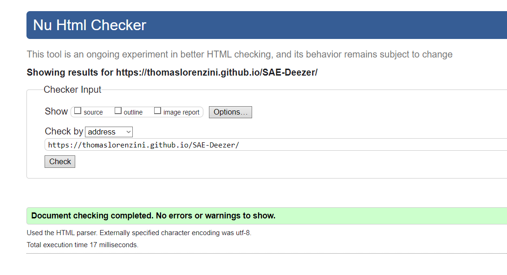
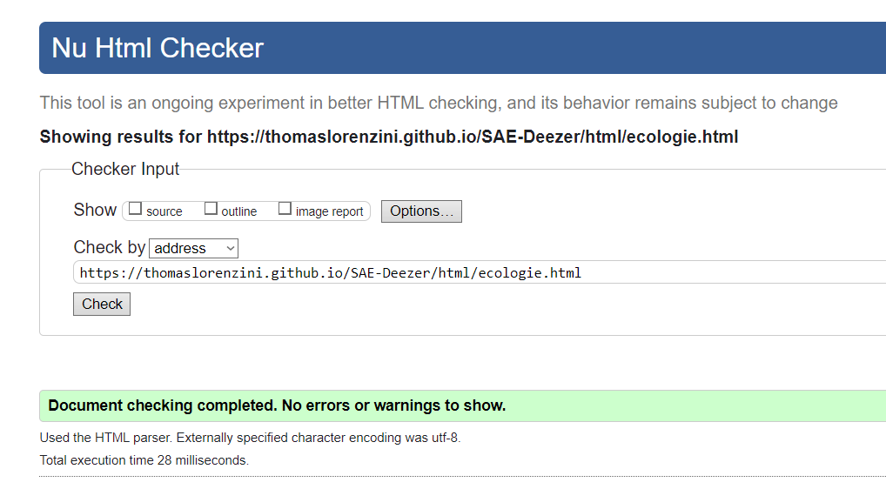
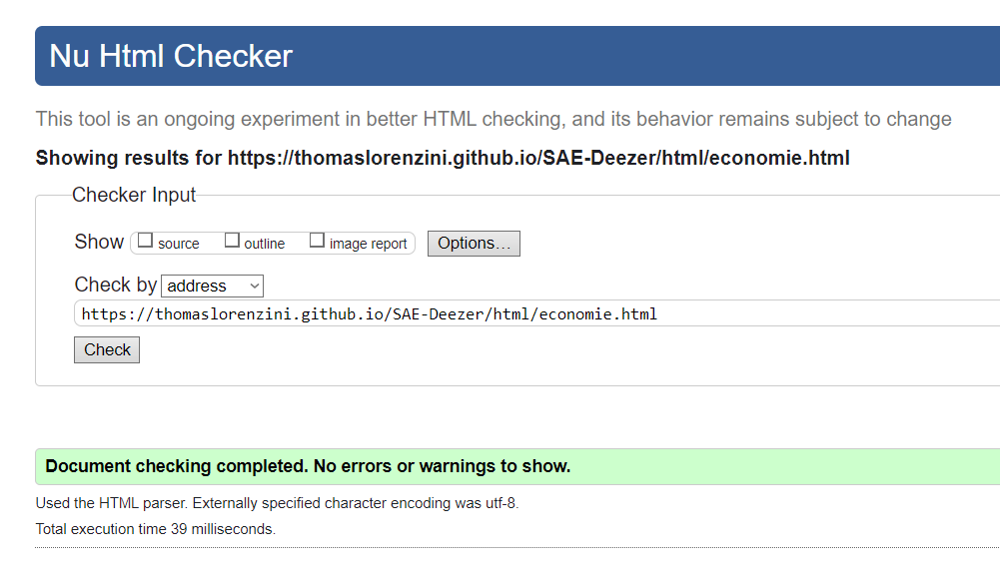
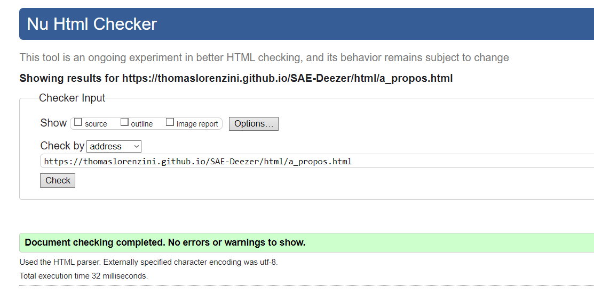
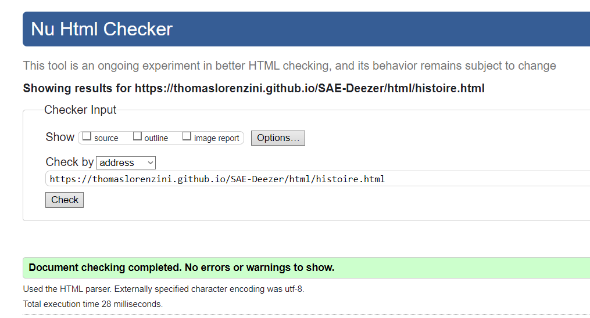
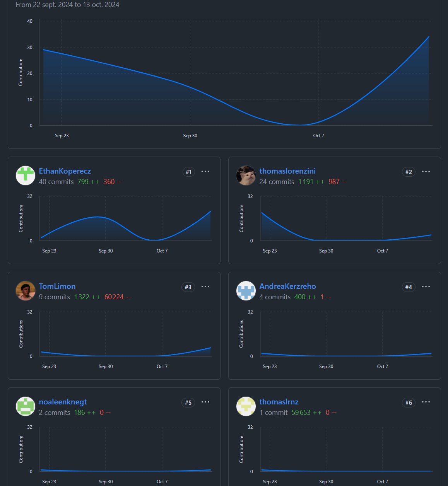

# SAE Deezer

## Sujet 

[SAE Deezer](https://thomaslorenzini.github.io/SAE-Deezer/)

## Membres du groupe :

- (référent du groupe) :  [Kerzreho Andréa](mailto:login@edu.univ-fcomte.fr?subject=SAE_1_05_06)  
- [Lorenzini Thomas](mailto:thomas.lorenzini@edu.univ-fcomte.fr?subject=SAE_1_05_06)   
- [Limon Tom](mailto:tom.limon@edu.univ-fcomte.fr?subject=SAE_1_05_06)  
- [Leenknegt Noa](mailto:noa.leenknegt@edu.univ-fcomte.fr?subject=SAE_1_05_06)  
- [Koperecz Ethan](mailto:ethan.koperecz@edu.univ-fcomte.fr?subject=SAE_1_05_06) 

# Présentation du projet

Ce dépôt correspond à un site web créé en HTML/CSS/JS dans le cadre de la SAÉ 05-06 à l'IUT de Belfort-Montbéliard. Ce site présente des informations concernant l'entreprise Deezer et sert de vitrine pour présenter l'entreprise, ses activité, son organisation et son historique.

### Page accueil
**Auteur : Lorenzini Thomas & Limon Tom**  
[Liens vers la page W3 validator de l'accueil](https://validator.w3.org/nu/?doc=https%3A%2F%2Fthomaslorenzini.github.io%2FSAE-Deezer%2F)

### Page écologie
**Auteur : Leenknegt Noa**  
[Liens vers la page W3 validator de la page ecologie](https://validator.w3.org/nu/?doc=https%3A%2F%2Fthomaslorenzini.github.io%2FSAE-Deezer%2Fhtml%2Fecologie.html)

### Page économie
**Auteur : Koperecz Ethan**  
[Liens vers la page W3 validator de la page economie](https://validator.w3.org/nu/?doc=https%3A%2F%2Fthomaslorenzini.github.io%2FSAE-Deezer%2Fhtml%2Feconomie.html)

### Page a propos
**Auteur : Kerzreho Andréa**  
[Liens vers la page W3 validator de la page a propos](https://validator.w3.org/nu/?doc=https%3A%2F%2Fthomaslorenzini.github.io%2FSAE-Deezer%2Fhtml%2Fa_propos.html)

### Page a propos
**Auteur : Limon Tom**  
[Liens vers la page W3 validator de la page histoire](https://validator.w3.org/nu/?doc=https%3A%2F%2Fthomaslorenzini.github.io%2FSAE-Deezer%2Fhtml%2Fhistoire.html)

## Répartition du travail

### Planification - Diagramme de GANTT

- Leenknegt Noa
- Koperecz Ethan

### Recherches d'informations

- Kerzreho Andréa
- Limon Tom
- Lorenzini Thomas
- Leenknegt Noa
- Koperecz Ethan

### Rapport économique

- Koperecz Ethan

### Rapport écologique

- Leenknegt Noa

### Développement site

- Lorenzini Thomas
  - Page d’accueil
  - Maquette du site sous Figma
- Limon Tom
  - Page histoire & page accueil
- Koperecz Ethan
  - Page économique
- Leenknegt Noa
  - Page écologique
- Kerzreho Andréa
  - Page à propos

## Contributeurs
thomaslorenzini = thomaslrnz (petit probl_me à la création du repo)
(les 60 000 lignes que vous pouvez constater lors du premier commit viennent du fait qu'on avait beaucoup de svg dans les premières versions du site)

