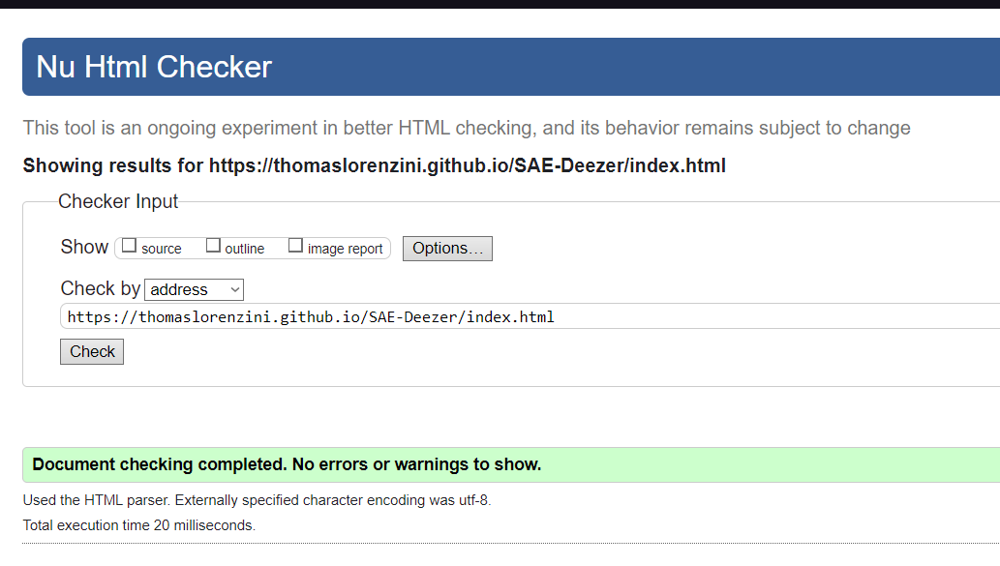

# SAE Deezer

## Sujet 

[SAE Deezer](https://thomaslorenzini.github.io/SAE-Deezer/)

## Membres du groupe :

Etudiant 1 (référent du groupe) :  [Andréa](mailto:login@edu.univ-fcomte.fr?subject=SAE_1_05_06)  
Etudiant 2 : [Thomas](mailto:thomas.lorenzini@edu.univ-fcomte.fr?subject=SAE_1_05_06)   
Etudiant 3 : [Tom](mailto:tom.limon@edu.univ-fcomte.fr?subject=SAE_1_05_06)  
Etudiant 4 : [Noa](mailto:noa.leenknegt@edu.univ-fcomte.fr?subject=SAE_1_05_06)  
Etudiant 5 : [Ethan](mailto:ethan.koperecz@edu.univ-fcomte.fr?subject=SAE_1_05_06) 

# Présentation du projet

Le projet consiste à développer un site web qui présente Deezer. Ce site permettra aux utilisateurs de découvrir ce qu'est Deezer et son . En plus, le site abordera les aspects économiques et écologiques liés à l'utilisation de Deezer.

[w3 validator index.html url](https://validator.w3.org/nu/?doc=https%3A%2F%2Fthomaslorenzini.github.io%2FSAE-Deezer%2Findex.html)
